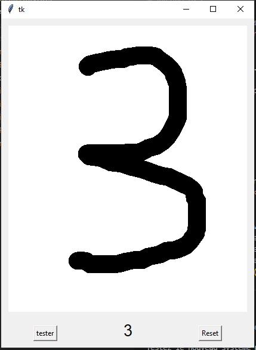

# classification_binaire

## Fenêtre TKinter

L'interface fonctionne comme suit:

Une fenêtre où l'on va retrouver 
  * un espace pour écrire le chiffre à tester
  * un bouton pour tester
  * un bouton pour reset la fenêtre 
  

## Fonctionnement de la fenêtre

Dans un premier temps, le réseau de neurones à été sauvegarder.
Une fois la fenêtre ouverte, il va falloir écrire un chiffre que l'on va tester avec notre modèle.
Pour ce faire, il faut simultanément appuyer sur Ctrl+Tracer à la souris.
Le chiffre est tracé, on clique sur le bouton tester. L'application va donc enregistrer le tracé en format .eps puis va le convertir en format .png.
Cette image sera ensuite entrée dans le modèle qui va essayer de déterminer le chiffre.
Une fois le travail effectué, on aura la valeur de sortie affichée en bas de la fenêtre. 
Sur la photo du dessus, le modèle a réussi à déterminer la valeur, mais il n'a pas 100% de réussite (exemple de l'image qui suit).
